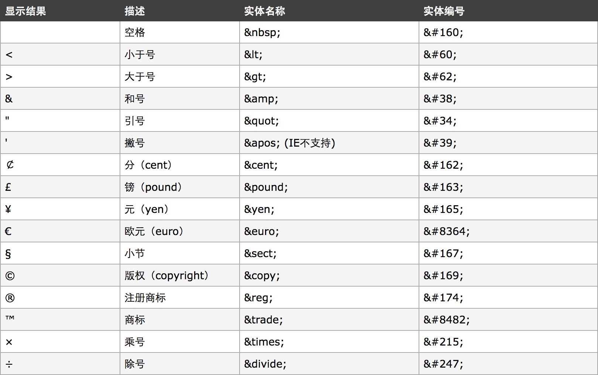

# HTML常用标签
## 一.常用标签

## 二.实体（转义符）
实体也就是转义符，有些符号本身就是HTML识别的代码字符，直接书写的话不能正确显示出来，这时候我们需要给他进行转义，比如小于号大于号本来就是HTML的标签左右，写上之后会被认为是标签。
实体以“&”开头，然后加上转义的名称，再加上一个“;”结束。

**常用转义符：**

> 实体对大小写敏感

## 三.图片格式
* **JPEG(jpg):** 支持颜色多，可压缩，所以体积小，但是无透明通道。一般用来保存照片。
* **GIF:** 支持颜色少，只支持简单透明（直线透明，不支持复杂的透明，如圆角周边），支持动态图。
* **PNG:** 支持颜色多，支持复杂透明通道。

> 使用原则：效果一致用最小，效果不一致用最好。

